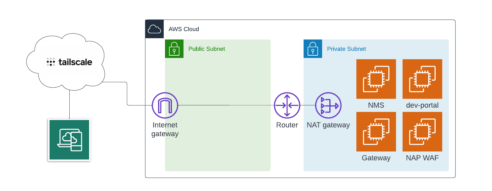

# NGINX Management Suite Lab

This repository will build out a 3 server deployment in AWS allowing the user to test the NGINX Management Suite, API Connectivity Manager, Developer Portal, and API Gateway instances.

> Note: This deployment leverages [Tailscale](https://tailscale.com/) to connect into the EC2 instances.



## Deployment

> Note: You will need to save your *nginx-repo.crt* and *nginx-repo.key* in the base folder of this project.

Run the following Terraform commands to deploy the environment:

```bash
terraform init
terraform deploy -auto-approve
```

## Configure NMS

Once the NMS server is up and running, you will need to reset the NMS admin password:

```bash
sudo htpasswd -c /etc/nms/nginx/.htpasswd admin
```

Next, you will need to login to the NMS UI and [add a license](https://docs.nginx.com/nginx-management-suite/admin-guides/getting-started/add-license/).

## Configure Developer Portal

Once the dev_portal server is up and running, you will need to [configure Postgres](https://docs.nginx.com/nginx-management-suite/admin-guides/installation/install-guide/#install-the-developer-portal):

1. configure PostgreSQL host-based authentication file:

    ```bash
    cat << EOF | sudo tee /etc/postgresql/12/main/pg_hba.conf

    # TYPE DATABASE USER ADDRESS METHOD

    local all postgres peer
    local all all md5
    # IPv4 local connections:
    host all all 127.0.0.1/32 md5
    # IPv6 local connections:
    host all all ::1/128 md5
    EOF
    ```

1. Restart PostgreSQL:

    ```bash
    sudo systemctl restart postgresql
    ```

1. Run the following commands:

    ```bash
    sudo -u postgres createdb devportal
    sudo -u postgres psql -c "CREATE USER nginxdm WITH LOGIN PASSWORD 'nginxdm';"
    sudo -u postgres psql -c "GRANT ALL PRIVILEGES ON DATABASE devportal TO nginxdm;"
    ```

1. Add NSJ directives in the top-level main context the nginx.conf file

    ```bash
    load_module modules/ngx_http_js_module.so;
    load_module modules/ngx_stream_js_module.so;
    ```

1. Start the Dev Portal:

    ```bash
    sudo systemctl start nginx-devportal
    ```
